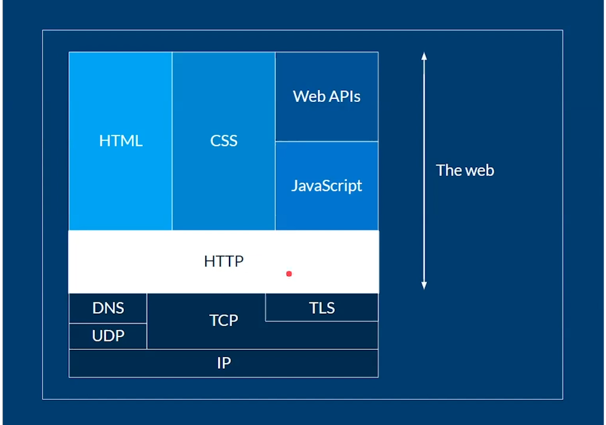
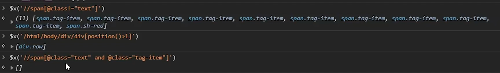
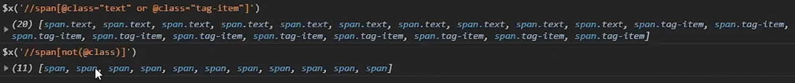
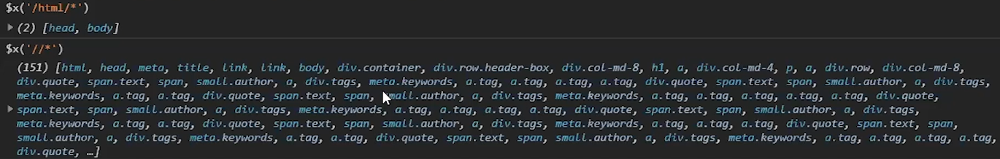
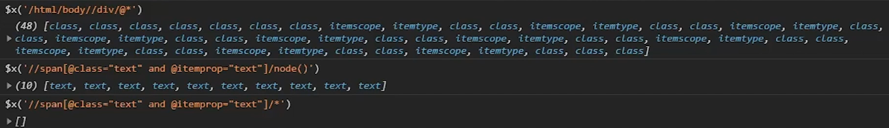

# Curso platzi fundamentos de web scraping y xpath

## Module 1

### Clase 3 Python: el lenguaje más poderoso para extraer datos

Herramientas mas usadas para web scraping con python:

- **Request**: libreria que nos permite controlar HTTP.

  - **HTTP**: conjunto de reglas a partir de la cuales se comunican dos computadoras en internet.

- **Beautifulsoup**: sirve para extraer informacion de un documento HTML.

Frameworks avanzados:

- **Seleniun**: Crea navegadores fantasmas y controla sitios webs de manera automatica. (crea bots).
-**Scrapy**: "El mas usado para hacer scrapy, es usado por el reino unido para recolectar los datos de la poblacion local todos los dias".

## Modulo 2 Entender la web

### Clase 4 Entender HTTP

Hyper text transfer protocol

Computador hace peticion y data center proporciona data.

**Cabeceras HTTP**.


**Protocolos que crean la web**.



### Clase 6 Robots.txt: permisos y consideraciones al hacer web scraping

El archivo Robots.txt es un documento guardado en raiz que especifica los permisos para implementar robots sobre la pagina, no cumplir estos permiso puede traer problemas legales.

un ejemplo para hayar este documento:

        https://pagina.com/robot.txt

## Modulo 3 XML Path Language

### Clase 7 XML Path lenguage

**Xpath** es una tecnica que permite extraer informacion de XML pero como HTML es bastante parecido tambien se le pueden aplicar Xpath.

**Ejemplo de Xpath aplicado**:

        //div/span//h1[@class="title"][1]

### Clase 8 Tipos de nodos en XPath

Cada nodo en Xpath reprecenta una etiqueta dentro de HTML.

#### Extra XPath Cheatsheet

| Expression   | Description |
|-----------------|:-------------|
| ```nodename```| Select all nodes with the name "nodename"   |
| ```/```  | A beginning single slash indicates a select from the root node, subsequent slashes indicate selecting a child node from current node  |
| ```//``` | Select direct and indirect child nodes in the document from the current node - this gives you the ability to "skip levels" |
| ```.```       | Select the current context node   |
|```..```  | Select the parent of the context node|
|```@```   |Select attributes|
|`text()`| Select the value of an element|
| &#124;|Pipe chains expressions and brings back results from either expression, think of a set union |


 for **Wildcards**

XPath wildcards can be used to select unknown XML nodes.

|Wildcard|Description|
|-----------------|:-------------|
|```*```|Matches any element node|
|```@*```|Matches any attribute node|
|```node()```|Matches any node of any kind|

 for **In-text search**

XPath can do in-text searching using functions and also supports regex with its matches() function. Note: in-text searching is case-sensitive!

|Path Expression|Result|
|-----------------|:-------------|
|```//author[contains(.,"Matt")]```| Matches on all author nodes, in current node contains Matt (case-sensitive)|
|```//author[starts-with(.,"G")]```|Matches on all author nodes, in current node starts with G (case-sensitive)|
|```//author[ends-with(.,"w")]```|Matches on all author nodes, in current node ends with w (case-sensitive)|
|```//author[matches(.,"Matt.*")]```| regular expressions match 2.0 |

 Complete syntax: **XPath Axes**

XPath Axes fuller syntax of how to use XPath. Provides all of the different ways to specify the path by describing more fully the relationships between nodes and their connections. The XPath specification describes 13 different axes:

- self ‐‐ the context node itself
- child ‐‐ the children of the context node
- descendant ‐‐ all descendants (children+)
- parent ‐‐ the parent (empty if at the root)
- ancestor ‐‐ all ancestors from the parent to the root
- descendant‐or‐self ‐‐ the union of descendant and self • ancestor‐or‐self ‐‐ the union of ancestor and self
- following‐sibling ‐‐ siblings to the right
- preceding‐sibling ‐‐ siblings to the left
- following ‐‐ all following nodes in the document, excluding descendants
- preceding ‐‐ all preceding nodes in the document, excluding ancestors • attribute ‐‐ the attributes of the context node


#### XPath in Chrome

View > Developer > Javascript Console. In the Console type in:
$x("/xpath/expression/goes/here").map(x => x.wholeText)

##### Examples

HTML View

```html

<!DOCTYPE html>
<html>
  <head>
    <title>HTML5 Layout</title>
  </head>
  <body>
    <div class="wrapper">
      <header>
        <h1>Yoko's Kitchen</h1>
        <nav>
          <ul>
            <li>
              <a href="home" class="current">home</a>
            </li>
            <li>
              <a href="classes">classes</a>
            </li>
            <li>
              <a href="catering">catering</a>
            </li>
            <li>
              <a href="about">about</a>
            </li>
            <li>
              <a href="contact">contact</a>
            </li>
          </ul>
        </nav>
      </header>
      <section class="courses">
        <a href="introduction.html">
          <article>
            <figure>
              
              <figcaption>Bok Choi</figcaption>
            </figure>
            <hgroup>
              <h2>Japanese Vegetarian</h2>
              <h3>Five week course in London</h3>
            </hgroup>
            <p>A five week introduction to traditional Japanese vegetarian meals, teaching you a selection of rice and noodle dishes.</p>
          </article>
        </a>
        <a href="sauces.html">
          <article>
            <figure>
              
              <figcaption>Teriyaki Sauce</figcaption>
            </figure>
            <hgroup>
              <h2>Sauces Masterclass</h2>
              <h3>One day workshop</h3>
            </hgroup>
            <p>An intensive one-day course looking at how to create the most delicious sauces for use in a range of Japanese cookery.</p>
          </article>
        </a>
      </section>
      <aside>
        <section class="popular-recipes">
          <h2>Popular Recipes</h2>
          <a href="yakitori.png">Yakitori (grilled chicken)</a>
          <a href="tsukune.png">Tsukune (minced chicken patties)</a>
          <a href="okonomiyaki.png">Okonomiyaki (savory pancakes)</a>
          <a href="mizutaki.png">Mizutaki (chicken stew)</a>
        </section>
        <section class="contact-details">
          <h2>Contact</h2>
          <p>Yoko's Kitchen
            <br />
            27 Redchurch Street
            <br />
            Shoreditch
            <br />
            London E2 7DP
          </p>
        </section>
      </aside>
      <footer>
        &copy; 2011 Yoko's Kitchen
      </footer>
    </div>
    <!-- .wrapper -->
  </body>
</html>
```

DOM Tree View


### Clase 9 Expresiones en XPath

| Path Expression   | Expression Result |
|-----------------|:-------------|
|```/html```|Select the root element catalog. Note: If the path starts with a slash ( / ) it always represents an absolute path to an element! Your absolute path is the same as your context in this case.|
|```//article```| Select all nodes with the name "article"|
|```//article/..``` |Selects all of the parents of the nodes with the name "article"|
|```/html/body/div/section/article/figure/img/@alt```|Select all img node alt attributes|
|```/section/*```|Select all the child element nodes of the section element|
|```//*```|Select all elements in the document|
|```//title[@*]```|Select all title elements which have at least one attribute of any kind|
|   ```//@*```    |Select all attributes|
| ```//@alt/..``` |For all nodes that have the alt attribute, select the immediate parent|
|```/html/body/div/aside/section[1]```| Select the first section element in /html/body/div/aside |
|```//*[@href]```|Select all elements with an href attribute |
|```/html/body/div/aside/section[@class="popular-recipes"]```|  Select section element with the attribute "popular-recipes" in /html/body/div/aside |
|```//a[@class!="current"]```|bring back all a elements where they have a class attribute but it isn't current|
|```//a[not(@class="current")]```|bring back all a elements except the ones that have a class attribute equal to current (Note: they do not need to have a class attribute) |
|```/descendant::h3```|Select all h3 element nodes|
|```//attribute::alt```|Select all alt attribute nodes|
|```//body/div/section/following-sibling::*```| Select all elements to the right (subsequent to) //body/div/section |

    nota:

    Los tipos de nodos que se reconocen en una consulta XPath no son los tipos de nodos que se encuentran en el DOM.

#### Tipos de nodos

- **Root** (Document): Nodo raiz del documento.
- **Element**: Un elemento, como ```<element>```.
- **Attribute**: Un atributo, como id='123'.
- **Namespace**: Un espacio de nombres, como xmlns="namespace".
- **Text**: Contenido de texto de un nodo. Equivalente al texto del DOM. Contiene por lo menos un carácter.
- **SignificantWhitespace**: Un nodo con caracteres de espacio en blanco y xml:space establecido en preserve.
- **Whitespace**: Nodo sólo con caracteres de espacio en blanco y sin espacio en blanco significativo. Los caracteres de espacio en blanco son #x20, #x9, #xD o #xA.
- **ProcessingInstruction**: Una instrucción de procesamiento, como <?pi test?>.
- **Comment**: Un comentario, como <!-- my comment -->.

      nota:

      Para practicar Xpath: http://toscrape.com/

### Clase 10 Predicados en Xpath

Permite la selection de un elemento o varios que esten dentro de un array.

 for **Predicates**

| Operator   | Explanation |
|-----------------|:-------------|
| ```[1]```  |Select the first node|
| ```[last()]```  |Select the last node|
| ```[last()-1]```  |Select the last but one node (also known as the second last node)|
|```[position()<3]```|Select the first two nodes, note the first position starts at 1, not = |
|```[@lang]```|	Select nodes that have attribute 'lang'|
|```[@lang='en']```|Select all the nodes that have a "attribute" attribute with a value of "en"|
|```[price>15.00]```|Select all nodes that have a price node with a value greater than 15.00|

### Clase 11 Operadores en Xpath

| Operator   | Explanation |
|-----------------|:-------------|
|```=```|Equivalent comparison, can be used for numeric or text values|
|```!=```|Is not equivalent comparison|
|```>, >=```|Greater than, greater than or equal to|
|```<, <=```|Less than, less than or equal to|
|```or```|Boolean or|
|```and```|Boolean and|
|```not```|Boolean not|

Note: Using '!=' is not the same as using 'not'.

- Ejemplo de uso:



- Ejemplo de uso:



### Clase 12 Wildcard en Xpath

`$x('/')` <- Trae todo el documento porque representa la raíz de nuestro el html
`$x('/*')` <- * después de / pide que traiga todos los nodos que están debajo de / (* es el primer wildcard)
`$x('/html/*')` <- Trae todos los nodos que están inmediatamente después de html
`$x('//*')` <- // es la expresión para saltar todos los niveles y con el * en todas las direcciones. Trae todos los nodos y todos los atributos de estos nodos.
`$x('//span[@class="text]/@*')` <- Trae todos los span, que tengan como clase “text”, con @* trae todos los atributos. Dicho de otra forma, trae todos los atributos de todos los nodos de tipo span de clase “text”.
`$x('/html/body//div/@*')` <- Todos los atributos (usando @*) de todos los div (usando //div) que están después de body
`$x('//span[@class="text" and @itemprop="text"]/node()')` <- Trae todos los spam que sean de clase “text” que tengan un atributo @itemprop “text” y de ahí (usando node()) traer todo lo que esté dentro de los spam que cumplen las condiciones

`node()` a diferencia de * trae no solamente los nodos, sino también todo el contenido

- Ejemplo de uso de `*`:



- Ejemplo de uso de `node()`:


